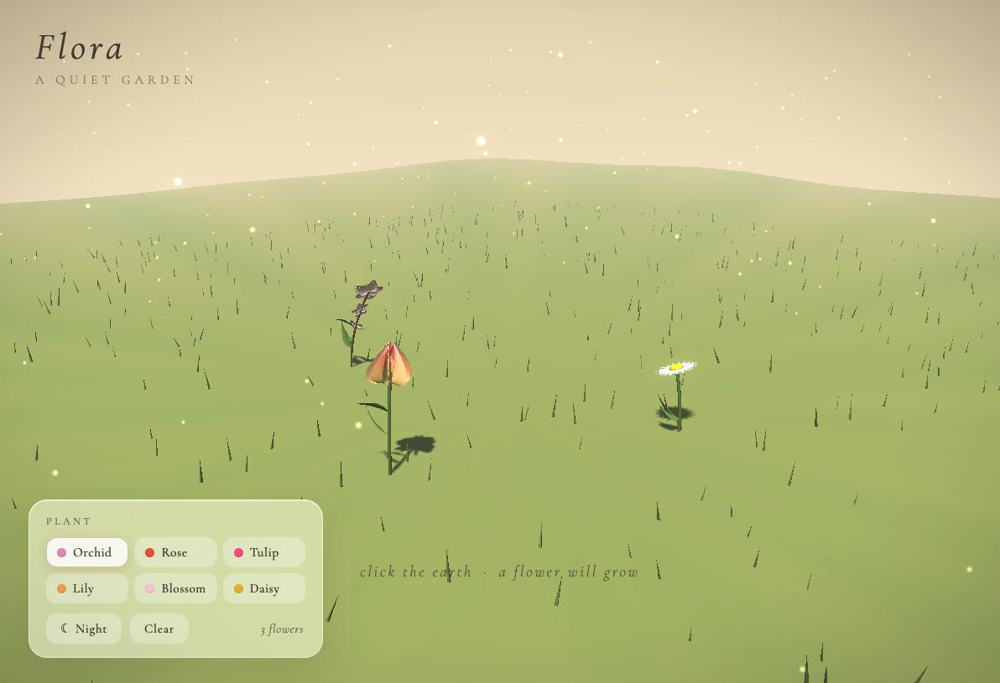

# Flora 🌸

*A quiet garden* — an interactive 3D meditative flower garden that lives in a single HTML file.

**▶ [Play it here](https://arecibo-sys.github.io/flora/)** — works on desktop, iPad, and iPhone.

## What it is

Flora is a small art-installation-style toy: a warm, softly lit meadow where you plant procedurally
generated flowers and watch them grow, sway in the breeze, and glow under a starry night sky.
There is no score, no goal, no timer — just gentle ambient sound and a garden that becomes yours.

Everything — geometry, terrain, sky, sound — is generated in code. No images, no 3D model files,
no build step. The only external dependency is Three.js from a CDN.

## Flowers

Each species is built from custom petal geometry (deformed, curved surfaces with base-to-tip
color gradients), not simple cones or spheres:

| Flower | Character |
| --- | --- |
| **Orchid** | Phalaenopsis form — five broad white-to-pink petals, magenta lip, central column |
| **Rose** | Five spiraled layers of cupped, ruffled coral petals around a tight center |
| **Tulip** | Cup shape from two offset rings of three petals, warm pink over a golden base |
| **Lily** | Recurved trumpet with six elongated petals, visible stamens and pistil |
| **Cherry blossom** | Notched pink petals with fine stamens, extra buds along a woody branch |
| **Daisy** | Two rings of slender white ray petals around a yellow disc |

Every flower grows on a naturally bent stem with procedural leaves, and no two are identical —
height, curvature, hue, and sway are all randomized. Once planted, flowers keep growing slowly
on their own; watering (or rain) just helps them along.

The garden has residents too: three butterflies flutter between the flowers and drop in to
hover over a bloom now and then, and every so often a little bunny hops across the meadow —
or a hedgehog shuffles through. When a critter passes close to a flower it stops to smell it,
nose twitching, with a little shimmer of scent rising from the petals.

## How to play

- **Tap / click the ground** — plant a flower where you touched
- **💧 Water** — toggle watering mode, then tap near a flower: droplets fall, and the
  flower gives a happy shimmy and grows a little fuller each time
- **Climate** ☀ 🌧 🍂 ❄ — change the season: summer sun, soft rain (which slowly waters
  every flower in the garden), amber autumn with drifting leaves, or quiet snowfall.
  Each crossfades gently and combines with day or night
- **Drag** — look around the garden
- **Scroll / pinch** — zoom in and out
- **Panel (bottom left)** — choose a species, water, set the climate, toggle day ↔ night, clear the garden
- Left alone, the camera drifts in a slow orbit

## Sound

All audio is generated live with the Web Audio API — nothing is streamed or loaded:

- A soft **wind bed** (filtered pink noise with slow, breathing modulation)
- A **relaxing ambient pad** — long, overlapping low pentatonic tones that slowly bloom and fade
- A sparse **music-box melody** that wanders a pentatonic scale with a gentle echo
- **Birdsong** — little synthesized chirps that call from left and right during the day
  (they take shelter when it rains), and **crickets** that take over after dark
- A gentle **pentatonic chime** when planting, and a **drip-drop** when watering

Sound starts on your first interaction (a browser requirement) and stays deliberately quiet.

## Under the hood

- **Three.js r128**, single `index.html`, ~44 KB
- Gradient sky dome shader with sun glow, stars that fade in at night
- Soft PCF shadows, exponential fog, 900 instanced grass blades on displaced terrain
- Custom three-pass **bloom** pipeline (bright-pass → separable gaussian blur → composite with
  vignette and tone shaping), written from scratch to stay dependency-free
- 260 drifting pollen particles that turn firefly-like after dark
- Wall-clock-based day/night crossfade, pointer-event input with manual delta tracking
  (so touch works on iOS Safari) and two-finger pinch zoom

## Run locally

Download `index.html` and open it in any modern browser. That's it.
